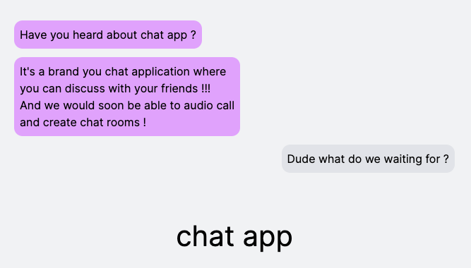

# Chat app frontend

Simple chat application to talk with friends

This is a [Next.js](https://nextjs.org/) project bootstrapped with [`create-next-app`](https://github.com/vercel/next.js/tree/canary/packages/create-next-app).

## Installation

```
npm i
```


## Getting Started

First, run the development server:

```bash
npm run dev
# or
yarn dev
# or
pnpm dev
# or
bun dev
```

Make sure the [backend](https://github.com/pmgzo/chat-app-backend) is running as well

Open [http://localhost:8080](http://localhost:3000) with your browser to see the result.
